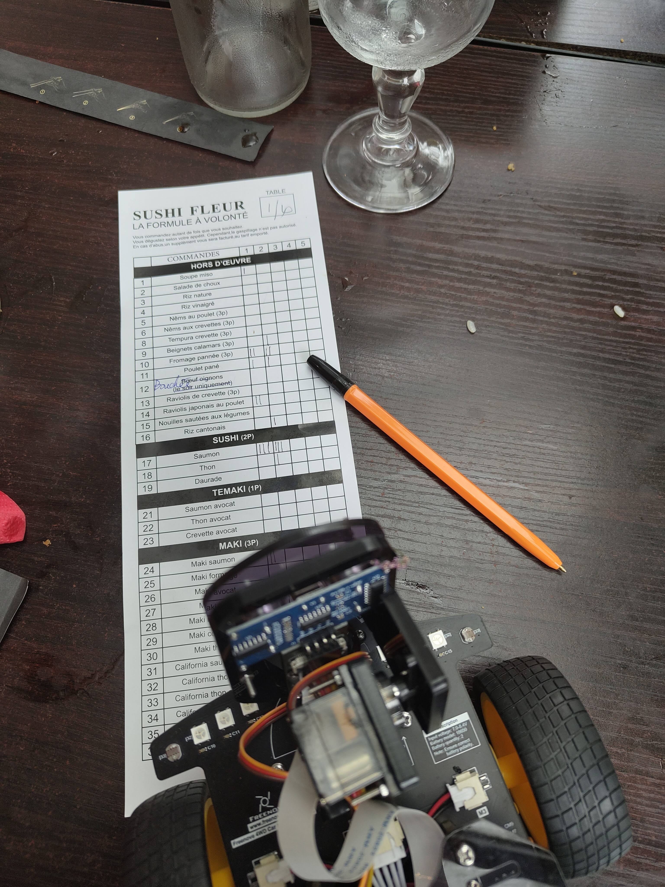
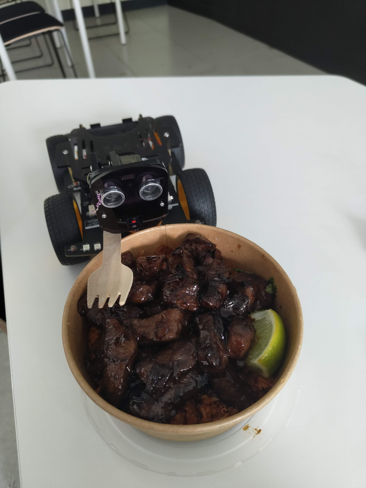
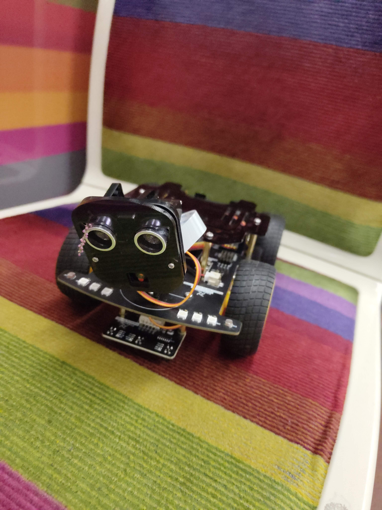

# yvees

> Searching for your tasks? Go to the [project board](https://github.com/users/arthur-fontaine/projects/5/views/3)

## Introduction

Yvees is a school project for [HETIC](https://www.hetic.net/). The goal is to
create a RC car that can be controlled by a mobile app.

We chose to create a service for museums. A museum visitor can rent a car to
visit the museum interactively with their smartphone.

The main features are:
- **A dashboard**

  It allows the museum staff to manage the cars.
  It also allows the museum staff to boot their new cars when they receive them.

- **A mobile app**

  The mobile app allows the visitor to control the car and visit the museum.
  It gives real-time information thanks to the camera on the car.

- **An automatic mode**

  The car can follow a black line on the ground.

## Setup

First, clone this repository:

```bash
git clone https://github.com/arthur-fontaine/yvees.git
```

This project is using a [Dev Container](https://containers.dev/), so you don't need to install anything on your machine except Docker.

> [!NOTE]
> If you are developing on macOS, I recommend using [OrbStack](https://orbstack.dev/). It's a fast and lightweight alternative to Docker Desktop, optimized for the ARM-based Macs.

The next of this setup guide assumes you use VS Code, but you can use any
editor you want.

When you open the project in VS Code, you may see a notification to install the
recommended extensions. Click on "Install All" to install them. If you don't see
the notification, you surely have the extensions already installed.

Now, open the command palette (Cmd+Shift+P) and run the command
`"Dev Containers: Reopen in Container"`. This will build the development
container and open a new VS Code window inside it.

To start to develop, refer to the [Development](#development) section.

## Packages/Apps

I think we can consider that this project relies on 4 main things:

- [Pnpm](https://pnpm.io/) for package manager.
- [Node.js](https://nodejs.org/) for the runtime.
- [TypeScript](https://www.typescriptlang.org/) for the language.
- [Turborepo](https://turbo.build/repo) for managing the monorepo.

The following packages are available:

| Package/App | Description | Type |
| --- | --- | --- |
| [`ui`](./packages/ui/) | This is the component library. It's built with [Tamagui](https://tamagui.dev/) to create components that are compatible with React and React Native. | Package |
| [`car`](./apps/car/) | This is the package that contains the program of the car and builds the binaries. | Package |
| [`db`](./apps/db/) | This is the package that contains the database. | Package |
| [`dashboard`](./apps/dashboard/) | This is the dashboard app. It's built with [React](https://reactjs.org/) and [Vite](https://vitejs.dev/). | App |
| [`mobile`](./apps/mobile/) | This is the mobile app. It's built with [React Native](https://reactnative.dev/) and [Expo](https://expo.dev/). | App |

All the apps are using [Agrume](https://agrume.js.org/) for the backend. It allows you to create the backend directly in the frontend code.

## Linting

This project is using [ESLint](https://eslint.org/).

To lint the project, run the following command:

```bash
pnpm lint
```

To fix the linting issues, run the following command:

```bash
pnpm lint --fix
```

You can also see all the rules by running the following command:

```bash
pnpm eslint --inspect-config
```

## Development

First, you need to initialize a SQLite database.
Just run the following command:

```bash
pnpm --filter="db" run migrate
```

Then, you need to create a Clerk organization.

Create a Clerk application named "mobile" (or whatever you want).
Then, create a `.env` file in the [`mobile`](./apps/mobile/) folder
and copy the "Publishable Key" of the application you just created.
It should look like this:

```env
EXPO_PUBLIC_CLERK_PUBLISHABLE_KEY="clerk_pk"
```

Create a second Clerk application named "dashboard" (or whatever you want).
Then, create a `.env` file in the [`dashboard`](./apps/dashboard/) folder
and copy the "Publishable Key" of the application you just created.
It should look like this:

```env
VITE_CLERK_PK="clerk_pk"
```

For now, as there is no sign-up system for museums, you need
to add a museum manually in the database using your Clerk organization ID.
You can do it by running the following command:

```bash
sqlite3 packages/db/sqlite.db "INSERT INTO museum (name, clerk_organization_id) VALUES ('My Museum', 'clerk_organization_id');"
```

After that, you need to generate the Expo dev clients
by running the following command:

```bash
pnpm --filter="mobile" run build-dev-clients
```

Finally, you can start the development server by running the following command:

```bash
pnpm install
```

```bash
pnpm dev
```

It will start the development script for each package/app.

### How to code properly?

- **Dependency Injection**: Use [Diabolo](https://diabolo.js.org/) to inject dependencies. Read this [article](https://khalilstemmler.com/articles/tutorials/dependency-injection-inversion-explained/) to understand what is Dependency Injection.
- **Commit Messages**: The only convention we use is that the sentence `If applied, this commit will <your commit message>` should make sense. Read this [article](https://chris.beams.io/posts/git-commit/) to understand what is a good commit message.
- **Branch Naming**: First, create an issue on GitHub. Then, click on the
"Create branch" button on the issue page. It will create a branch properly
named.

## Next Steps

The current state of the project is a MVP. We want to improve it by adding more
features, fixing bugs. Take a look at the [issues page](https://github.com/arthur-fontaine/yvees/issues).

As this project was developed quickly, the code quality is not the best. We want
to :
- **Add more tests.** As we are using Diabolo for Dependency Injection, we can
easily implement tests by mocking the dependencies and testing the services.
- **Use React Query.** Currently, the most requests are managed manually with
`useEffect` and `useState`. We want to use React Query instead.
- **Implement authentication.** Currently, there is very little security in the
app. We want to implement authentication to secure the app. It is easy to do
with Agrume (just add a parameter in the server functions).
- **Improve the development experience.** Dev Containers became a bit unstable
lately. We used it because it was easy to set up, and it was working well on
every machine (Windows, macOS, Linux). But we lost more time fixing bugs
introduced by Dev Containers than it saved us. We want to switch to a more
classic setup.
- **Improve the design.** The codebase is built to scale easily the design. We
want to improve the design to make it more user-friendly.
- **Improve the ESLint configuration.** Some rules are a bit buggy, especially
the indentation rules. We want to fix them.

## Photoshoot 😎

<table>

<tr>
<td>

*Yvees working as a barman<br>(he brought a beer to a <br>customer)*


</td>
<td>

*Yvees working as a barman<br>(he brought back a bottle<br>and cleaned
the table)*


</td>

<td>

*Yvees smoking<br>(he's thinking about<br>
his life (he has a<br>lopsided head, he doesn't take it well))*


</td>

<td>

*Yvees drunk<br>(he had a hard day)*


</td>

<td>

*Yvees ordering food<br>(he's hungry)*



</td>

<td>

*Yvees eating<br>(he's enjoying his meal)*



</td>

<td>

*Yvees just vibing*


</td>

<td>

*Yvees in the metro<br>(he's going to home)*



</td>

</tr>

</table>
